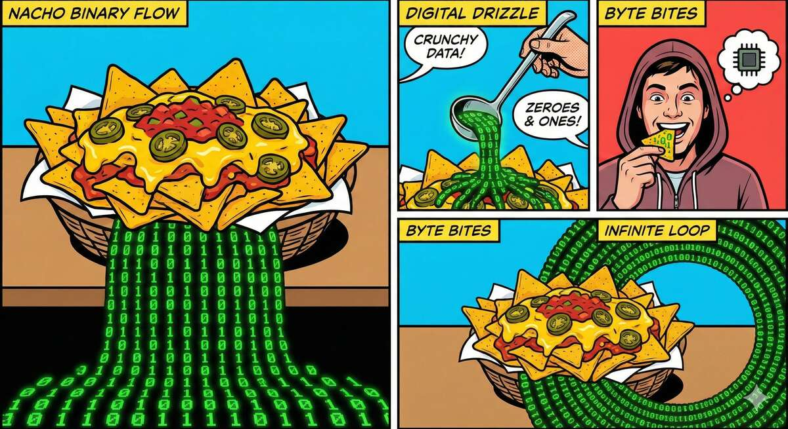

<p align="center">
  
</p>

<h1 align="center">NACHOS</h1>

<p align="center"><strong>Not Another CBOR Handling Object System</strong></p>

> RFC 8949 CBOR encoder/decoder with full source map support for interactive debugging

[](https://www.npmjs.com/package/@marcuspuchalla/nachos)
[](https://www.typescriptlang.org/)
[](https://www.gnu.org/licenses/gpl-3.0)
[]()

A production-ready, zero-dependency CBOR (Concise Binary Object Representation) codec implementation in TypeScript. Works in Node.js and browsers.

## 0.4.0 release candidate

The September audit repairs are staged locally. Publication and the production app rollout await review. The full resolution record and reproducible evidence are in [audits/2026-09-09](audits/2026-09-09).

```ts
import { decodeLossless, encodeLossless, nodeToCborJson, nodeToDiagnostic } from '@marcuspuchalla/nachos'

const decoded = decodeLossless('a201006131f93c00', {
  profile: 'rfc8949', allowTrailingData: false
})
nodeToDiagnostic(decoded.node) // {1: 0, "1": 1.0}
nodeToCborJson(decoded.node)   // typed map entry pairs; the float stays a float
encodeLossless(decoded.node)  // exact original bytes, including widths and chunks
encodeLossless(decoded.node, { canonical: true, mapKeyOrder: 'bytewise' })
```

The wire node is a snapshot. `encodeLossless(node)` reproduces its original bytes and ignores edits to convenience values; use `encode(value)` for edits. Native JavaScript numbers and Maps cannot express every wire distinction. Use the node APIs for authoritative diagnostics, typed export, NaN payloads, and byte preservation. `cborSemanticEqual` compares CBOR types and values, independently of widths and map order.

| Decode profile | Policy |
| --- | --- |
| `permissive` (default) | Inspect well-formed CBOR, preserve unknown tags and tolerated invalid tag contents. Pass `allowTrailingData: false` for exactly one item. |
| `rfc8949` | Strict UTF-8, duplicate rejection, implemented core tag validity, one complete item. |
| `deterministic` | RFC 8949 validity plus shortest encodings, bytewise map order, no indefinite values. NaN sign/payload are preserved when enforcing shortest width. |
| `cardano` | RFC 8949 validity plus implemented recursive Plutus constructor/data and chunk rules. This is not complete ledger, era CDDL, CIP-21 or signature validation. |

Legacy `strict` keeps its earlier combined policy. Use explicit profiles for new code. Length-first deterministic ordering remains available via `mapKeyOrder: 'length-first'` with canonical validation/encoding. Encoder defaults remain compatible; request bytewise ordering explicitly for core deterministic output. Parser limits now share depth, input, output and elapsed-time budgets across traversal and sequences; the time limit is cooperative, not thread cancellation.

`validateRegisteredTags: true` enables the implemented RFC 8746 typed-array/dimension checks, RFC 8943 dates, RFC 9090 OIDs and UUID-length validation. `typedArrayView` and `decodeObjectIdentifier` provide optional interpretations. The pinned IANA registry supplies names and references only; a registry entry does not imply implemented semantic validation. Regenerate names with `python3 scripts/generate-tag-registry.py`.

The diagnostic parser supports the documented common and extended forms, including base32 and indefinite strings. It is not a complete implementation of every extended-diagnostic draft grammar. For typed re-encoding use `fromDiagnostic(text, { preserveFloatType: true })`.

## Features

- ✅ **RFC 8949 core codec** - All major types, configurable validity checks, source maps and lossless wire inspection
- ✅ **Zero Dependencies** - No runtime dependencies, ~25KB minified
- ✅ **TypeScript First** - Complete type definitions with strict mode
- ✅ **Source Maps** - Bidirectional linking between hex bytes and decoded values
- ✅ **Cardano Support** - Plutus constructor tags (121-127, 1280-1400, 102)
- ✅ **Canonical Encoding** - Deterministic encoding for blockchain use cases
- ✅ **Tree-Shakeable** - Import only what you need
- ✅ **Browser & Node.js** - Works everywhere with ES2020 support

## Installation

```bash
npm install @marcuspuchalla/nachos
```

## Quick Start

### Decoding CBOR

```typescript
import { decode } from '@marcuspuchalla/nachos'

// Decode integer
const result = decode('1864')
console.log(result.value)  // 100

// Decode string
decode('6449455446')  // { value: "IETF", bytesRead: 5 }

// Decode array
decode('83010203')  // { value: [1, 2, 3], bytesRead: 4 }

// Decode map — maps decode to real Map instances (key types are preserved:
// integer keys stay integers, byte-string keys stay Uint8Arrays)
decode('a16161 01')  // { value: Map { "a" => 1 }, bytesRead: 4 }

// Decode tagged value (Cardano)
decode('d87980')  // { value: { tag: 121, value: [] }, bytesRead: 3 }

// Decode bignum (tags 2/3) — values beyond ±2^64 become BigInt
decode('c249010000000000000000')  // { value: { tag: 2, value: 18446744073709551616n }, ... }
```

### Encoding CBOR

```typescript
import { encode } from '@marcuspuchalla/nachos'

// Encode number
encode(100)  // { hex: "1864", bytes: Uint8Array[0x18, 0x64] }

// Encode string
encode("IETF")  // { hex: "6449455446", bytes: ... }

// Encode array
encode([1, 2, 3])  // { hex: "83010203", bytes: ... }

// Encode map with canonical ordering
encode({ z: 1, a: 2 }, { canonical: true })
// Keys are sorted length-first (RFC 7049 §3.9 / Cardano CIP-21) by default:
// shorter encoded keys first, ties broken bytewise. Opt in to RFC 8949
// §4.2.1 core deterministic (pure bytewise) order with:
encode({ z: 1, a: 2 }, { canonical: true, mapKeyOrder: 'bytewise' })

// Encode tagged value
encode({ tag: 121, value: [] })  // { hex: "d87980", bytes: ... }

// Encode bignum — bigints beyond ±2^64 automatically use tag 2/3
encode(2n ** 70n)  // { hex: "c249400000000000000000", bytes: ... }
```

### Source Maps (Interactive Debugging)

```typescript
import { decodeWithSourceMap } from '@marcuspuchalla/nachos'

const { value, sourceMap } = decodeWithSourceMap('d87980')

// Source map links hex bytes to decoded values
console.log(sourceMap)
// [
//   {
//     path: '',
//     start: 0,
//     end: 3,
//     majorType: 6,
//     type: 'Tag 121',
//     children: ['.value']
//   },
//   {
//     path: '.value',
//     start: 2,
//     end: 3,
//     majorType: 4,
//     type: 'Array',
//     parent: ''
//   }
// ]

// Use for hex-to-JSON highlighting in visualizers
const entry = sourceMap.find(e => e.path === '.value')
console.log(`Array is at hex bytes ${entry.start}-${entry.end}`)
```

## API Reference

### Functional API (Recommended)

```typescript
// Decoder
import { decode, decodeWithSourceMap } from '@marcuspuchalla/nachos'

decode(hexString: string, options?: ParseOptions): ParseResult
decodeWithSourceMap(hexString: string, options?: ParseOptions): ParseResultWithMap

// Encoder
import { encode, encodeToHex, encodeToBytes, encodeSequence } from '@marcuspuchalla/nachos'

encode(value: EncodableValue, options?: EncodeOptions): EncodeResult
encodeToHex(value: EncodableValue, options?: EncodeOptions): string
encodeToBytes(value: EncodableValue, options?: EncodeOptions): Uint8Array
encodeSequence(values: EncodableValue[], options?: EncodeOptions): EncodeResult
encodeSelfDescribed(value: EncodableValue, options?: EncodeOptions): EncodeResult

// Diagnostic notation (RFC 8949 §8)
import { toDiagnostic, fromDiagnostic, decodeToDiagnostic } from '@marcuspuchalla/nachos'

toDiagnostic(value: unknown, options?: DiagnosticOptions): string
fromDiagnostic(diagnostic: string): unknown
decodeToDiagnostic(hexString: string, options?: DiagnosticOptions): string
```

### Class API (Alternative)

```typescript
import { CborDecoder, CborEncoder } from '@marcuspuchalla/nachos'

// Decoder with persistent options
const decoder = new CborDecoder({ strict: true })
const result1 = decoder.decode('1864')
const result2 = decoder.decodeWithSourceMap('d87980')

// Encoder with persistent options
const encoder = new CborEncoder({ canonical: true })
const encoded1 = encoder.encode(100)
const encoded2 = encoder.encodeToHex([1, 2, 3])
```

## Options

### Parser Options

```typescript
interface ParseOptions {
  strict?: boolean                    // Enable all validations (Cardano mode)
  validateCanonical?: boolean         // Validate canonical encoding
  allowIndefinite?: boolean           // Allow indefinite-length encoding (default: true)
  dupMapKeyMode?: 'allow' | 'warn' | 'reject'  // Duplicate map key handling (default: 'warn')
  mapKeyOrder?: 'length-first' | 'bytewise'    // Canonical key order (default: 'length-first')
  validateUtf8Strict?: boolean        // Strict UTF-8 validation
  validateSetUniqueness?: boolean     // Reject duplicate items in tag-258 sets
  validateTagSemantics?: boolean      // Validate standard tag content (tags 0-5, 32-36, …)
  validatePlutusSemantics?: boolean   // Validate Plutus constructor tags (102, 121-127, 1280-1400)
  unwrapSelfDescribed?: boolean       // Unwrap top-level tag 55799 (default: false)
  allowTrailingData?: boolean         // Allow bytes after the top-level item (default: true, false in strict)
  limits?: {
    maxInputSize?: number             // Max input bytes (default: 10 MB)
    maxOutputSize?: number            // Max output bytes (default: 100 MB)
    maxStringLength?: number          // Max string length (default: 1 MB)
    maxArrayLength?: number           // Max array length (default: 10,000)
    maxMapSize?: number               // Max map size (default: 10,000)
    maxDepth?: number                 // Max nesting depth (default: 100)
    maxTagDepth?: number              // Max tag nesting depth (default: 100)
    maxBignumBytes?: number           // Max bignum content bytes (default: 1024)
    maxParseTime?: number             // Max parse time ms (default: 1000)
  }
}
```

Note: duplicate map keys are handled by the parser's `dupMapKeyMode`
(`rejectDuplicateKeys` is an *encoder* option).

### Encoder Options

```typescript
interface EncodeOptions {
  canonical?: boolean                 // Canonical encoding (shortest form, sorted maps)
  allowIndefinite?: boolean           // Allow indefinite-length encoding
  rejectDuplicateKeys?: boolean       // Reject duplicate map keys
  mapKeyOrder?: 'length-first' | 'bytewise'  // Canonical key order (default: 'length-first')
  maxDepth?: number                   // Maximum nesting depth (default: 100, matches parser)
  maxOutputSize?: number              // Maximum output size bytes (default: 100 MB)
  maxBignumBytes?: number             // Max bignum content bytes for tag 2/3 (default: 1024)
  selfDescribed?: boolean             // Wrap output in tag 55799 (d9d9f7 prefix)
}
```

## Examples

### Cardano Transaction Decoding

```typescript
import { decode } from '@marcuspuchalla/nachos'

// Real Cardano UTXO collateral
const collateralHex = '8282582048bd01d51e580cde15afa6d28f63d89c9137b93a910e5941192e26b12906106700'
const result = decode(collateralHex)

console.log(result.value)
// [[<txHash>, <outputIndex>], ...]
```

### Canonical Encoding for Blockchain

```typescript
import { encode } from '@marcuspuchalla/nachos'

// Canonical encoding ensures deterministic output
const tx = {
  inputs: [{ txId: "abc", index: 0 }],
  outputs: [{ address: "addr1...", amount: 1000000 }]
}

const { hex } = encode(tx, { canonical: true })
// Always produces the same hex string (deterministic)
```

### Round-Trip Encoding/Decoding

```typescript
import { encode, decode } from '@marcuspuchalla/nachos'

const original = { a: 1, b: [2, 3], c: "hello" }

// Encode
const { hex } = encode(original)

// Decode — CBOR maps decode to Map instances (key types are preserved)
const { value } = decode(hex)

console.log(value)  // Map { "a" => 1, "b" => [2, 3], "c" => "hello" }

// Prefer Map end-to-end for lossless round-trips (integer keys, byte keys):
const tx = new Map([[0, 'inputs'], [2, 170000]])
decode(encode(tx).hex).value  // Map { 0 => "inputs", 2 => 170000 }
```

### Self-Described CBOR (Tag 55799)

```typescript
import { encodeSelfDescribed, decode } from '@marcuspuchalla/nachos'

// Wrap output in tag 55799 (RFC 8949 §3.4.6) — starts with magic bytes d9d9f7
encodeSelfDescribed(100)                    // { hex: "d9d9f71864", ... }
encode(100, { selfDescribed: true })        // same

// Transparently unwrap when decoding
decode('d9d9f71864', { unwrapSelfDescribed: true })  // { value: 100, ... }
decode('d9d9f71864')                                 // { value: { tag: 55799, value: 100 }, ... }
```

### Diagnostic Notation (RFC 8949 §8)

```typescript
import { toDiagnostic, fromDiagnostic, decodeToDiagnostic } from '@marcuspuchalla/nachos'

// Value → diagnostic notation
toDiagnostic(new Map([['a', [1, new Uint8Array([0xff])]]]))  // '{"a": [1, h\'ff\']}'

// Diagnostic notation → value (full parser: bigints, floats, escapes,
// h'…'/b64'…' byte strings, arrays, maps, tags, simple(n), indefinite forms)
fromDiagnostic('{"a": [1, h\'ff\']}')   // Map { "a" => [1, Uint8Array [255]] }
fromDiagnostic('121([])')               // { tag: 121, value: [] }
fromDiagnostic('18446744073709551616') // 18446744073709551616n

// Decode + annotate with byte offsets from the source map
decodeToDiagnostic('8101', { showOffsets: true })  // "[1 /* 1-2 */] /* 0-2 */"
```

### Standard Tags

- **Tags 2/3 (bignums)**: decoded to `{ tag, value: BigInt }`; bigints beyond
  ±2⁶⁴ encode automatically as tag 2/3 with minimal-length content.
- **Tags 21-23 (expected later encodings)**: decoded as pass-through
  `{ tag, value }` wrappers — no conversion is applied. Use
  `useCborTag().applyExpectedEncoding(tagged)` to obtain the base64url /
  base64 / base16 string form the tag promises (diagnostic/interop use).
- **Tags 32-36 (URI, base64url, base64, regexp, MIME)**: content is validated
  (text type, URI scheme, base64/base64url alphabet) when
  `validateTagSemantics: true` (or `strict: true`) is set.
- **Tag 55799 (self-described CBOR)**: see above.

### Streaming with CBOR Sequences

```typescript
import { encodeSequence, decode } from '@marcuspuchalla/nachos'

// Encode multiple values as sequence (RFC 8742)
const { hex } = encodeSequence([1, "hello", [2, 3]])

// Decode manually (parser stops after each value)
const result1 = decode(hex)  // 1
const result2 = decode(hex.slice(result1.bytesRead * 2))  // "hello"
// ... etc
```

## Supported CBOR Types

| CBOR Type | JavaScript Type | Example |
|-----------|-----------------|---------|
| Unsigned Integer (MT 0) | `number`, `bigint` | `42`, `18446744073709551615n` |
| Negative Integer (MT 1) | `number`, `bigint` | `-1`, `-18446744073709551616n` |
| Byte String (MT 2) | `Uint8Array` | `new Uint8Array([0xff, 0x00])` |
| Text String (MT 3) | `string` | `"hello"` |
| Array (MT 4) | `Array` | `[1, 2, 3]` |
| Map (MT 5) | `Object`, `Map` | `{ a: 1 }` |
| Tagged Value (MT 6) | `{ tag, value }` | `{ tag: 121, value: [] }` |
| Simple/Float (MT 7) | `boolean`, `null`, `undefined`, `number` | `true`, `null`, `3.14` |



## Cardano Support

Full support for Cardano Plutus Data encoding:

- **Tag 121-127**: Compact constructors (0-6 fields)
- **Tag 1280-1400**: Extended constructors (7+)
- **Tag 102**: Alternative constructor encoding

```typescript
import { decode } from '@marcuspuchalla/nachos'

// Plutus constructor tag 121 (Constructor 0)
const plutusData = decode('d87980')  // Constructor 0, []

// Tag 122 (Constructor 1, 1 field)
decode('d87a81182a')  // Constructor 1, [42]

// Tag 102 (Alternative encoding)
decode('d8668218c8811863')  // Constructor 200, [[99]]
```

## Testing

This library is validated against the [taco](https://github.com/marcuspuchalla/taco) correctness test suite, with explicit per-requirement observations and separate validation profiles. Passing the corpus is evidence for those cases, not a claim to implement every CBOR-based application protocol.

## Browser Compatibility

Requires ES2020+ for BigInt support:

- ✅ Chrome 67+
- ✅ Firefox 68+
- ✅ Safari 14+
- ✅ Edge 79+
- ✅ Node.js 18+

## Security

Security features:
- ✅ **Depth limits** - Prevents stack overflow (default: 100)
- ✅ **Size limits** - Prevents memory exhaustion
- ✅ **Timeout protection** - Prevents infinite loops
- ✅ **UTF-8 validation** - Rejects invalid sequences
- ✅ **Overflow detection** - Safe integer arithmetic

Report security issues via [GitHub Issues](https://github.com/marcuspuchalla/nachos/issues).

## Optional protocol tools

The codec now includes incremental RFC 8742 decoding (`createSequenceDecoder`,
`decodeSequenceStream`), RFC 9164 address/prefix/interface interpretation
(`decodeIpAddress`), and RFC 9581 time/duration/period interpretation
(`decodeExtendedTime`). Pass a lossless node to the semantic helpers, or enable
`validateRegisteredTags` to check their tag contents while decoding. Extended time
retains exact coefficients and timescale identifiers; it does not silently convert
TAI or other scales to UTC.

`verifyCoseSign1`, `verifyCoseSign`, and `importCoseKey` verify COSE signatures with
explicit trusted keys and Web Crypto. Supported algorithms are ES256, ES384,
ES512, EdDSA and the RFC 9864 ESP256/ESP384/ESP512/Ed25519/Ed448 identifiers
(Edwards curves require runtime support). Detached payloads,
external AAD, protected headers, critical-header handlers and COSE EC2/OKP keys
are supported. Verification does not establish trust in a key or certificate.

CDDL validation is an optional, explicitly initialized WASM module:

```ts
import { readFile } from 'node:fs/promises'
import { createRequire } from 'node:module'
import { createCddlValidator } from '@marcuspuchalla/nachos/cddl'

const require = createRequire(import.meta.url)
const wasm = await readFile(require.resolve('@marcuspuchalla/nachos/cddl.wasm'))
const validator = createCddlValidator(wasm)
validator.validate('82016161', 'root = [uint, tstr]')
validator.validateCip21(transactionHex)
```

In a browser, fetch the exported WASM asset using your bundler's URL support.
Run untrusted schemas in a terminable worker: schema byte limits cannot bound
recursive evaluation time. The app and TACO enforce worker deadlines.

`validateCip21` checks the pinned Conway CDDL, canonical serialization and CIP-21
restrictions. It accepts a body or a three/four-element transaction envelope and
reports its checked scope. Set `catalystRegistration: true` for the exceptional
Catalyst signing workflow. This checks serialized compatibility; ledger execution,
signatures and a particular hardware wallet's support are separate questions.

The optional backend is MIT-licensed cddl-rs 0.10.7 with local RFC 8610 repairs.
Its source revision, patch, Cargo lockfile and artifact hashes are under
`specs/roadmap-2026-09`; rebuild with `node scripts/build-cddl.mjs` (Rust,
wasm32 target and wasm-pack required). The core TypeScript codec has no runtime
package dependencies and never loads the backend implicitly. See the September
21 audit for tested scope and interoperability evidence.

## Development

```bash
# Install dependencies
npm install

# Build library
npm run build

# Run tests
npm test

# Type check
npm run type-check

# Watch mode
npm run build:watch
```

## License

GPL-3.0 © 2025 Marcus Puchalla

## Demo

See this library in action at [cbor.app](https://cbor.app).

## Related

- [RFC 8949 - CBOR Specification](https://datatracker.ietf.org/doc/html/rfc8949)
- [RFC 8742 - CBOR Sequences](https://datatracker.ietf.org/doc/html/rfc8742)
- [Cardano Plutus Data Encoding](https://cips.cardano.org/)

## Contributing

Contributions welcome! Please open an issue or PR.

## Changelog

See [CHANGELOG.md](./CHANGELOG.md) for release history.
